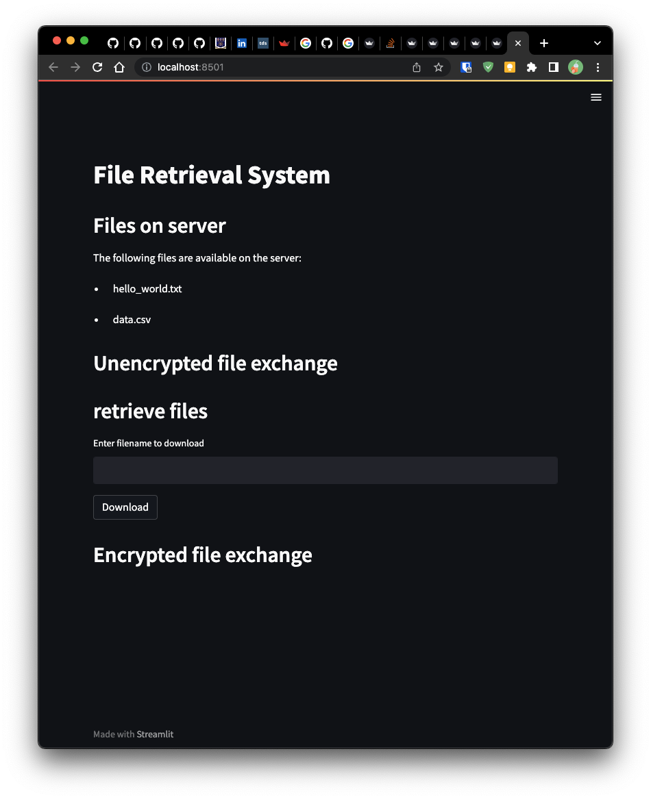

# FILE RETRIEVAL SYSTEM

CSCD 604: DISTRIBUTED SYSTEM

COURSE WORK 1

## Group 8 Contributors

| Student                 | ID Number                 |
| :---------------------- | :------------------------ |
| ABRAHAM TAMATEY         | 11005270                  |
| EMMANUEL PEASAH-DARKWAH | 11005092                  |
| GIDEON AHIADZI          | 11010651                  |
| MICHAEL KWAME JOHNSON   | 11005246                  |
| OBED BARNES             | 11005038                  |
| GIDEON KWAME KUDROHA    | 11009553                  |
| PASCAL A. TAMEKLOE      | 11005243                  |

## Getting Started

Clone repository to your local and navigate into the folder

```bash
git clone https://github.com/horlali/file-retrieval-system
cd file-retrieval-system/
```

Create  and fill out the environment variable files

```bash
cp .env.example .env
```

## Setup Local Environment

Install the required dependencies

```bash
pip install -r requirements.txt

```

## Make Scripts Executable

```bash
chmod +x scripts/*
```

## Running Servers

In the root of the repository `:~/file-retrieval-system` run the scripts below

```bash
./scripts/run-server.sh
```

whiles the server is running open another terminal and run the client script

```bash
./scripts/run-client.sh
```

## Sample Request and Application Docs

Once the application is up and running, visit <http://127.0.0.1:8501/> or <http://localhost:8501> or in your browser

You should see a Swagger Documentation Page like this



## Changes required for the implementation above to work on a physical network

For the changes to work on a physical we need to we need to change the environment variable file to match requirements for the server

```bash
OBJECT_ID = "the desired object id"
HOST = "the hostname of the server"
PORT = "the port you want the app to run on"
```
