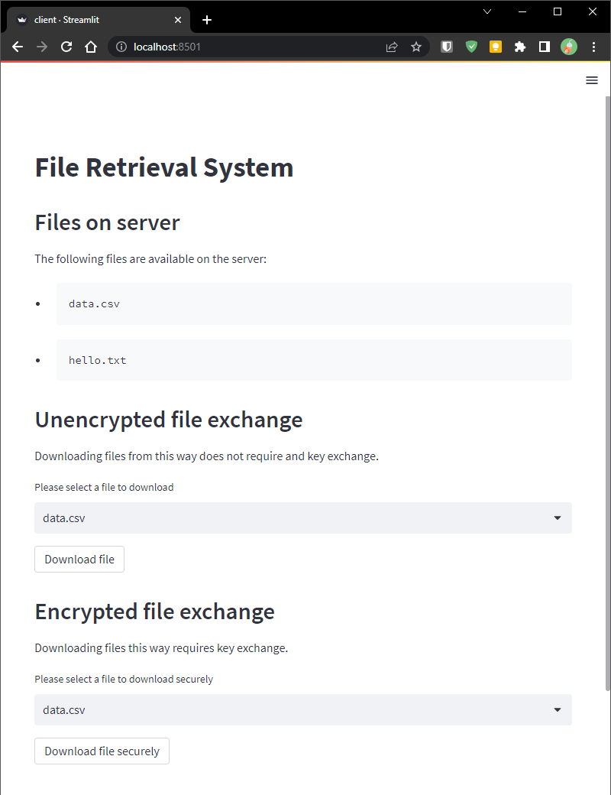

# FILE RETRIEVAL SYSTEM

CSCD 604: DISTRIBUTED SYSTEM

COURSE WORK 1

## Group 8 Contributors

| Student                 | ID Number                 |
| :---------------------- | :------------------------ |
| ABRAHAM TAMATEY         | 110*****                  |
| EMMANUEL PEASAH-DARKWAH | 110*****                  |
| GIDEON AHIADZI          | 110*****                  |
| MICHAEL KWAME JOHNSON   | 110*****                  |
| OBED BARNES             | 110*****                  |
| GIDEON KWAME KUDROHA    | 110*****                  |
| PASCAL A. TAMEKLOE      | 110*****                  |

## Getting Started

Clone repository to your local and navigate into the folder

```bash
git clone https://github.com/horlali/file-retrieval-system
cd file-retrieval-system/
```

Create  and fill out the environment variable files

```bash
cp .env.example .env
```

## Dev Toolchain

- [python ^3.11](https://www.python.org/) main programming language
- [poetry](https://python-poetry.org/) for dependency management
- [pytest](https://docs.pytest.org/en/stable/) for testing
- [coverage](https://coverage.readthedocs.io/en/coverage-5.5/) for test coverage
- [black](https://github.com/psf/black) for code styling
- [isort](https://pycqa.github.io/isort/) for import sorting styling
- [flake8](https://flake8.pycqa.org/en/latest/) for linting

## Setup Local Environment

It is preferable to create and activate a virtual environment before installing the dependencies. You can read more about python virtual environments and how to create and activate it [here](https://realpython.com/python-virtual-environments-a-primer/)

Install the required dependencies

```bash
pip install -r requirements.txt
poetry install
```

## Make Scripts Executable

```bash
chmod +x scripts/*
```

## Running Servers

In the root of the repository `:~/file-retrieval-system` run the scripts below

```bash
./scripts/run-server.sh
```

whiles the server is running open another terminal and run the client script

```bash
./scripts/run-client.sh
```

## Sample Request and Application Docs

Once the application is up and running, visit <http://127.0.0.1:8501/> or <http://localhost:8501> or in your browser

You should see a Streamlit Page like this



## Changes required for the implementation above to work on a physical network

For the changes to work on a physical we need to we need to change the environment variable file to match requirements for the server

```bash
OBJECT_ID = "the desired object id"
HOST = "the hostname of the server"
PORT = "the port you want the app to run on"
```
